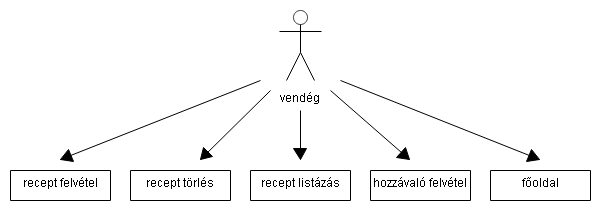
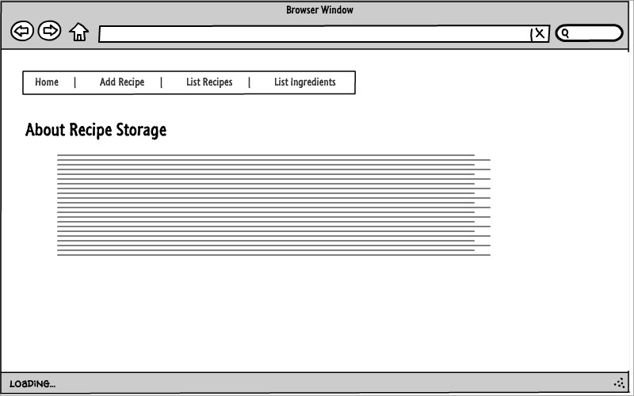
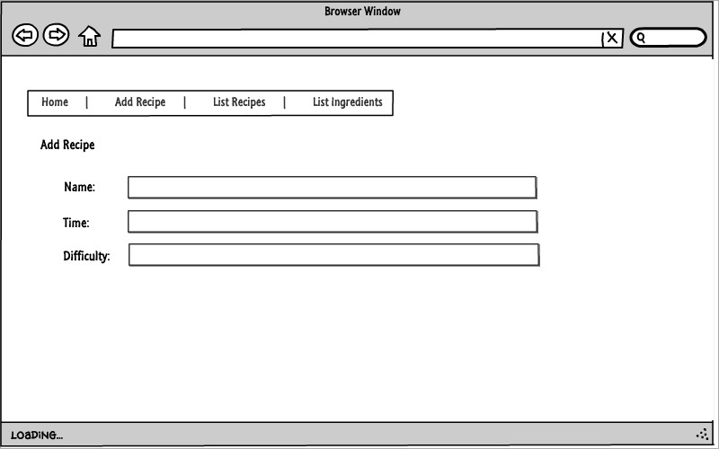
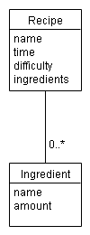
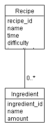

# Követelményanalízis

## Funkcionális követelmények

Írni egy web-alkalmazást, amivel létre lehet hozni és nyílvántartani recepteket
és hozzávalókat. Elvárt követelmények aminek
tartalmaznia kell:

* legalább két modellt, egy-sok kapcsolatban
* legalább 1 űrlapot
* legalább 1 listázó oldalt
* legyen lehetőség új felvételére
* legyen lehetőség meglévő szerkesztésére
* legyen lehetőség meglévő törlésére
* REST API végpont kialakítása
* Szerveroldali perzisztálás fájlba

## Nem funkcionális követelmények

* egyszerű és áttekinthető dizájn
* A weboldal könnyen bővíthető

## Szerepkörök

* **vendég:** a kezdőlap tartalmához, a receptek és hozzávalók listájához fér hozzá, illetve 
* felvehet új recepteket és hozzávalókat, amelyeket módosíthatja illetve törölheti azokat.

## Használateseti-modell

## Folyamatok meghatározása

# Tervezés

## Oldaltérkép

Publikus:

- Főoldal
- Receptek felvétele
- Receptek listázása/törlése
- Hozzávaló felvétele/módosítása

## Végpontok

* GET /főoldal
* GET /listrecipe receptek listázása
* POST /addrecipe új recept felvétele
* POST /addnewingredient új hozzávaló felvétele
* GET /listingredient hozzávalók kilistázása
* GET /listrecipeingredient recepthez tartozó hozzávalók kilistázása

## Oldalvázlatok

Főoldal

Recept felvétele

## Adatmodell

## Adatbázisterv

Adattáblák szöveges leírása:

    Név: recipe
    Leírás: a receptben tároljuk a recepthez szükséges adatokat
    Attribútumok:
        - id(egész): recept azonosítója
        - name(szöveg): recept megnevezése
        - time(szöveg): az elkészítési idő
        - difficulty(szöveg): nehézségi szint
        - ingredients(objektum): a recept hozzávalók
    Kapcsolatok: a hozzávalók táblával

    Név: ingredient
    Leírás: a recept hozzavaloinak adatai
    Attribútumok:
        - id(egész): hozzávaló azonosítója
        - name(szöveg): hozzávaló neve
        - amount(szoveg): hozzavalok szovegesen jellemzhető mennyísége
    Kapcsolatok: a recipe táblával áll kapcsolatban

#Felhasználói dokumentáció

## Implementáció

Az alkalmazás a Cloud9 webes fejlesztői környezetben iródott.
Fejlesztő környezetek:

    - Cloud9

## Könyvtárstruktúra

    ./app mappán belüli mappa struktúra
    ./adapters adapter
    ./components komponenesek
    ./controllers kontrollerek
    ./model modellek
    ./route routerek
    ./style css fájl helye
    ./template html templatek
    
# Futtatás
A futtáshoz böngésző és internet szükséges.

# Telepítés lépései
A Cloud9 webes felületés parancssorába beirva: 

    - git clone <repository-url> repository cím
    - tegyük át egy új mappába
    - npm install
    - bower install
    
# Program használata (futtatása)
Szintén a Cloud9 webes felületés parancssorba beirva: 
    
    - node server.js
    - ember server